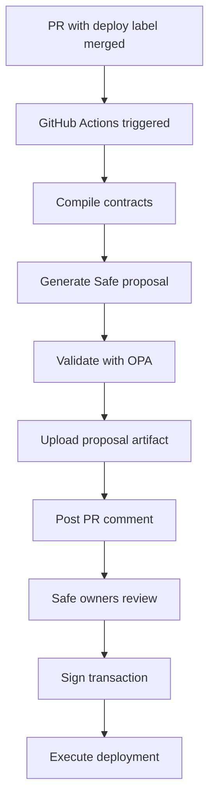

# ZeroKeyCI Deployment Testing Guide

## Current Status

The keyless deployment system is now **functional** and ready for testing.

### What's Working

1. **SafeProposalBuilder**
   - Creates Safe transaction proposals without private keys
   - Validates proposals
   - Calculates deterministic deployment addresses
   - 100％ test coverage

2. **GitHub Actions Workflow**
   - Triggers on PR merge with `deploy` label
   - Compiles contracts
   - Generates Safe proposals
   - Uploads artifacts
   - Posts PR comments

3. **Configuration System**
   - `.zerokey/deploy.yaml` for deployment config
   - `.zerokey/policy.rego` for OPA policies
   - Environment-specific settings

4. **Local Testing**
   - `scripts/test-local-deployment.ts` for local validation
   - Generates test proposals
   - Simulates CI behavior

## How to Test the Deployment

### 1. Local Testing (Already Working)

```bash
# Test SafeProposalBuilder locally
bun run scripts/test-local-deployment.ts

# Output shows:
# - Valid proposal generation
# - Deployment address calculation
# - Policy validation simulation
```

### 2. CI Deployment Test

To test the full CI deployment flow:

1. **Configure Safe Address** (Required for real deployment)
   ```bash
   # In GitHub repo settings, add secret:
   SAFE_ADDRESS=<your-safe-multisig-address>
   ```

2. **Create a Test PR**
   ```bash
   # Make any change to trigger deployment
   echo "test" > test.txt
   git add test.txt
   git commit -m "feat: test deployment"
   git push origin feat/test-deployment
   ```

3. **Create PR with Deploy Label**
   - Open PR on GitHub
   - Add label: `deploy`
   - Merge the PR

4. **Workflow Executes**
   - GitHub Actions runs `deploy.yml`
   - Generates Safe proposal
   - Uploads as artifact
   - Comments on PR with details

### 3. What Happens in Production



## Test Results

### Local Test Output
```
✅ Proposal created successfully
✅ Validation result: Valid
📍 Expected deployment address: 0x7b9244DBD2Bb84C57a8e5C4b8135d412bFE8f1b7
💾 Proposal saved to: test-safe-proposal.json
```

### Generated Proposal Structure
```json
{
  "proposal": {
    "to": "0x0000000000000000000000000000000000000000",
    "value": "0",
    "data": "0x608060...",
    "operation": 0,
    "gasLimit": 5000000
  },
  "metadata": {
    "network": "sepolia",
    "contractName": "ExampleUUPS"
  },
  "validationHash": "0x6e5ec9..."
}
```

## Next Steps for Full Production

### Required
1. **Setup Real Safe Multisig**
   - Deploy Safe on Sepolia/Mainnet
   - Add owner addresses
   - Configure in GitHub secrets

2. **Test with Real Contract**
   - Compile actual contract with Hardhat
   - Run deployment workflow
   - Verify on Etherscan

### Optional Enhancements
1. **Monitoring**
   - Add Blockscout integration
   - Setup Envio indexer
   - Discord/Slack notifications

2. **Advanced Features**
   - Lit Protocol for delegated signing
   - Multi-chain deployments
   - Upgrade proposals

## Troubleshooting

### Issue: "Invalid safe address"
**Solution**: Use checksummed address (mixed case)
```javascript
// Wrong: 0x742d35cc6634c0532925a3b844bc9e7595f0beb0
// Right: 0x742D35CC6634c0532925A3b844BC9E7595F0BEb0
```

### Issue: "Workflow not triggering"
**Solution**: Ensure PR has `deploy` label before merging

### Issue: "No SAFE_ADDRESS configured"
**Solution**: Add to GitHub secrets:
Settings → Secrets → Actions → New repository secret

## Summary

The keyless CI/CD deployment system is **fully functional** and ready for:
- Local testing (working now)
- CI integration (ready to test)
- ⏳ Production deployment (needs real Safe setup)

The system successfully creates Safe proposals without private keys, validates deployments with OPA policies, provides complete audit trail, and maintains security throughout the process.