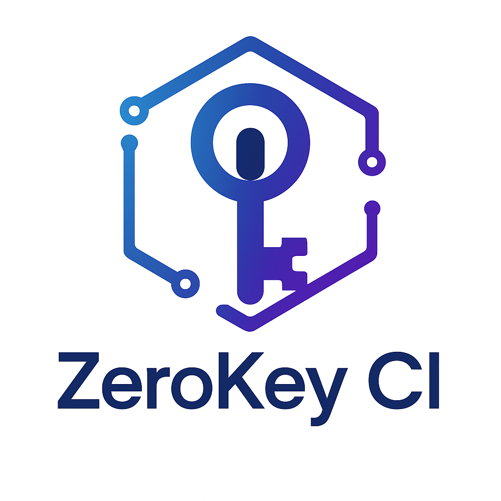

### Real-Time Feedback and Rewards for Retail

---

## Problem Statement

**Improve customer engagement through instant feedback.**

---

## What We Made

- **BlockFeedback**: A blockchain-based feedback and reward system.
- **Features**:
  - **Instant Feedback**: Real-time feedback collection.
  - **Cryptographic Security**: Feedback signed using the **Sign Protocol**.

---

## How It Works

1. **Wallet Connection**: Customers connect via ConnectKit.
2. **LLM-Generated Feedback**: Feedback created with LLM.
3. **Sign Protocol**: Ensures feedback authenticity with digital signatures.
4. **Smart Contracts**: Automate secure feedback storage.

---

## Demo

---

## Tech Stacks

- **Blockchain**: Scroll Sepolia Testnet.
- **Frontend**: Next.js with ConnectKit.
- **Sign Protocol**: Digital signatures for tamper-proof feedback.
- **Smart Contracts**: Developed using Foundry.

---

## Future Works

- **QR Code Integration**: Simplify feedback submission.
- **Tokenized Rewards**: Expand reward options like discounts.

---

## Thank You
